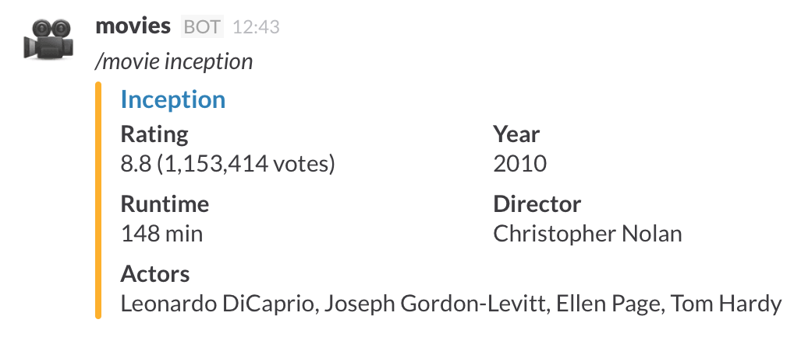

# slack-movie [](https://gemnasium.com/matiassingers/slack-movie)
> slack command for getting movie info





## Running locally
```sh
$ git clone git@github.com:matiassingers/slack-movie.git && cd slack-movie
$ npm install
$ npm start
```

Your local copy should now be running at [`localhost:1337`](http://localhost:1337).


## Deploying to Heroku
```sh
$ heroku create
$ git push heroku master
$ heroku open
```

Alternatively, you can deploy your own copy with one click using this button:

[](https://heroku.com/deploy?template=https://github.com/matiassingers/slack-movie)

See the [Heroku documentation](https://devcenter.heroku.com/articles/config-vars) for more info about changing the configuration variables after deployment.


## Slack setup
1. Create a Slack [incoming WebHook][slack-webhook] integration *(settings aren't important, note the WebHook URL)*
2. Deploy your copy of `slack-movie`, and note your URL endpoint
3. Create a Slack [slash command][slack-command] integration with default settings and use the URL endpoint from above *(optionally note the token for extra security)*
4. *Optional: Add autocomplete help text to Slack command:*
  


## Settings
The following environment variables needs to be set for the command to work, if you use the Heroku Button above it'll ask for these automatically.

- `SLACK_HOOK_URL` - *Slack [incoming WebHook][slack-webhook] URL*
- `USERNAME` - *Username to use when replying with the conversion result (default: movies)*
- `EMOJI` - *Emoji icon to use when replying with the conversion result (default: :movie_camera:)*
- `SLACK_TOKEN` - *Additional security step: Slack [slash command][slack-command] token for verification that the request came from your Slack team (not required)*


## todo
- Figure out how to add [Slack attachments](https://api.slack.com/docs/attachments) `image_url`, would work really well with a movie poster


## Related
- [`generator-slack-command`](https://github.com/matiassingers/generator-slack-command)
- [`slack-currency`](https://github.com/matiassingers/slack-currency)


## License

MIT © [Matias Singers](http://mts.io)

[slack-webhook]: https://my.slack.com/services/new/incoming-webhook/
[slack-command]: https://my.slack.com/services/new/slash-commands
